## Glossary

**Vision-language-action model (VLA).** A single network mapping camera images and a language instruction to robot actions. RT-2 and OpenVLA are the reference points. What decides deployability is what runs underneath to turn the output into motion at control rate.

**Dual-system stack (S2/S1/S0).** A decomposition by rate. S2 is a slow vision-language model reasoning about scene and task, 5 to 10 Hz. S1 is a fast visuomotor policy, 100 to 200 Hz. S0 is low-level control, around 1 kHz. Figure's Helix runs S2 at 7 to 9 Hz and S1 at 200 Hz, and Helix 02 adds S0 at 1 kHz for whole-body control.

**Action chunking.** Predicting a short horizon of future actions in one inference pass, then executing the chunk before predicting the next. It trades reactivity for stability and lets a slow model drive a fast loop.

**Flow matching.** A continuous-action generation method, a close cousin of diffusion, used by Physical Intelligence's action expert. It emits action chunks at up to 50 Hz without discretizing the action space.

**Real-time chunking (RTC).** Physical Intelligence's inference scheme that generates the next chunk while the current one is still executing, so the loop does not stall on the model. It holds up under inference delays above 300 ms.

**World model and video-prediction policy.** Instead of predicting actions, predict future frames of video, then recover the actions that would produce that future. UniPi and AVDC are the academic anchors.

**Inverse dynamics model (IDM).** The component that reads a predicted state transition, two frames or a short clip, and outputs the action that causes it. The bridge from predicted pixels to motor commands.

**Direct Video-Action (DVA).** Rhoda AI's approach: a causal video model trained on internet video predicts the near future, and an inverse dynamics model turns those frames into end-effector motion, in a closed loop.

**World Action Model (WAM).** NVIDIA GEAR's name for a model that predicts future video and the actions that produce it jointly, inside one network, rather than bolting an action decoder onto a separate video model. DreamZero is the reference implementation.

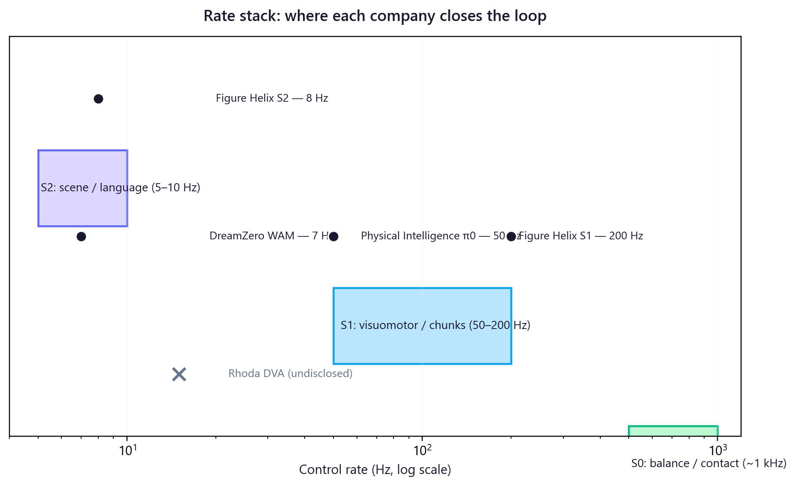

## The disclosure tell

Every robot foundation model company publishes a blog, and most of them publish a number. Dyna folds napkins at 99.4% over a 24 hour run. Generalist reports 99% on tasks where its prior model managed 64. The numbers are real and the demos are uncut. They are also close to useless for telling you whether the full control stack closes the loop in the field, because a success rate on a self-chosen task is a marketing artifact, not a benchmark.

The revealing signal is what a company will disclose about the loop itself. Not the success rate, but the rate stack. Not the demo, but where the model meets the controller, what the inference latency is, and how the training data was collected. A company that publishes its control frequencies, its action representation, and its latency budget is making a falsifiable claim about its system design. A company that publishes a percentage and a highlight reel is asking you to take the architecture on faith.

This post grades five companies on that basis: Physical Intelligence, Dyna Robotics, Generalist AI, Skild AI, and Rhoda AI. I read each one through three lenses. The first is loop legibility: does the public record disclose the rate stack and the inference latency, or does it stop at the highlight reel. The second is action representation: where does the loop actually close, in flow-matched action chunks, in predicted video decoded by an inverse dynamics model, or somewhere the company will not say. The third is data economics: how expensive is the next task, measured in hours of robot data, and what kind of data is it.

Two of the five disclose enough to defend. One of those two has the most coherent published stack in the field. Then there is Rhoda, doing something different enough to earn its own section. The second half of this post is about its approach, robot control as a video prediction problem, and what it buys along three axes: how well it generalizes, how cheaply it can be fine-tuned, and how large the market is for the tasks it can actually do.

## Grading the loop

Physical Intelligence is the only company on this list whose stack you can read end to end without a non-disclosure gap.

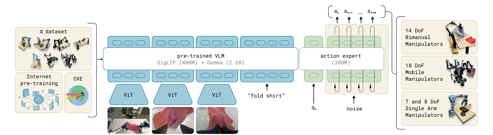

π0 (arXiv 2410.24164) pairs a 3B-parameter vision-language backbone with a separate action expert that emits continuous actions by flow matching, which is how it drives dexterous tasks like laundry folding in action chunks at up to 50 Hz. π0.5 (arXiv 2504.16054) adds open-world generalization with a two-level inference pass: the model first writes the next subtask in language, then the action expert produces the motor commands. Knowledge Insulation (arXiv 2505.23705) trains the backbone on discrete action tokens while the expert learns continuous control, with gradients blocked between the two so the language prior survives training.

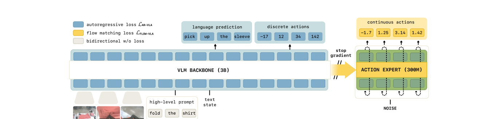

Then there is the piece that decides the argument. Real-Time Execution of Action Chunking Flow Policies (arXiv 2506.07339, NeurIPS 2025) generates the next action chunk while the current one is still executing, and holds up under inference delays above 300 ms, more than 30% of the prediction horizon, at roughly 97 ms of model latency. Pi released the weights through openpi. That is a control loop you can audit, latency budget included.

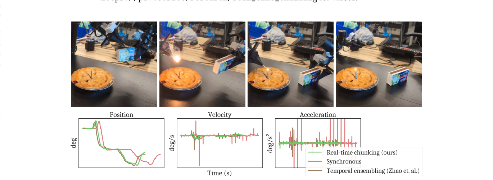

The contrast with the rest is sharp on the first lens. Dyna Robotics publishes the most convincing deployment evidence in the group, DYNA-1 folding napkins at 99.4% over a 24 hour run with no human intervention, on the back of a scalable reward model that lets the system recover from its own errors and generate its own training data. What Dyna does not publish is a rate stack, an action representation, or a model card. The 24 hour number is the strongest robustness signal here, and it is also a self-run demo on a task the company chose. High on deployment, low on legibility.

Generalist AI sits in the middle. GEN-0 was pretrained on more than 270,000 hours of manipulation data, growing about 10,000 hours a week, and the company reports the first robotics scaling laws, downstream performance rising as a power law with pretraining data. The base model uses no robot data at all. It learns from low-cost wearable data gloves that record human activity. GEN-1, in April 2026, reports 99% success on tasks where the prior model managed 64%, at roughly three times the speed, with one hour of robot data per task. The data story is the most concrete in the field. The control loop is named, Harmonic Reasoning inference and a new form of paged attention, but not specified to the Hz. High on data economics, partial on legibility.

Skild AI is the cleanest example of the gap this post is about. The Skild Brain is pitched as an omni-bodied model that controls any embodiment through in-context learning, trained on human video and large-scale simulation, and the company raised into a valuation above $14B on roughly $30M of 2025 revenue. The founders' academic record is real. The company's public technical disclosure is not. No rate stack, no action representation, no benchmark table, no model card. This is the highest hype-to-disclosure ratio of the five, and on the first two lenses it scores near zero.

Rhoda AI I grade fully in the next section, because its approach needs its own treatment. On the lenses: its Direct Video-Action method is unusually legible at the conceptual level, a causal video model feeding an inverse dynamics model in a closed loop, and its data economics are the most aggressive claim in the group, 10 to 20 hours of robot data per task. What it does not disclose is the one thing a deployment claim needs, the on-robot control rate and the inference hardware.

The pick is Physical Intelligence, and the reason is the second lens as much as the first. At Fulfil we run a planning and controls stack over more than 20,000 SKUs, and the question that decides whether a model is deployable is never the success rate in the highlight reel. It is what happens to the loop when inference is slow, when the network adds latency, when the action the model proposed is half-executed and the world has already moved. RTC is the only published answer to that question on this list. Pi is not the flashiest demo and it is not the largest raise. It is the only stack I could hand to a controls engineer and have them tell me, from the public record alone, whether it will close the loop on our floor.

## Control as a video prediction problem

Rhoda AI came out of stealth in March 2026 with $450M and a reported $1.7B valuation, founded by Jagdeep Singh of QuantumScape with a research team out of the generative-video and computational-imaging world. Its bet is that robot control is a video prediction problem. The method, which Rhoda calls Direct Video-Action, trains a causal video model from scratch on hundreds of millions of internet videos, then conditions it on a long history of frames plus proprioception and a language goal to predict the near future. A separate inverse dynamics model reads those predicted frames and outputs end-effector motion. The robot executes, observes the result, and the loop repeats every few hundred milliseconds.

The idea is not new. UniPi (arXiv 2302.00111) framed control as text-guided video generation with an inverse model recovering the actions, back in 2023.

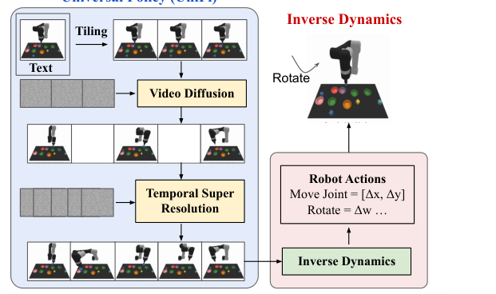

AVDC (arXiv 2310.08576) learned to act from actionless video through dense correspondences. GR-2 (arXiv 2410.06158) pretrained on 38 million clips and reported 97.7% across more than 100 tasks. What Rhoda adds is two engineering claims: training the video model causally from scratch rather than distilling a bidirectional one, and running full video denoising inside a real-time closed loop, with training and inference tricks (it calls them Context Amortization and Leapfrog Inference) to hide the generation latency. The economic claim is the sharp one. Decanting was post-trained on 11 hours of robot data, container breakdown on 17, and the inverse dynamics model can be trained on random, non-expert motion.

In February 2026, NVIDIA's GEAR lab made that bet concrete and, unlike Rhoda, fully open. DreamZero (arXiv 2602.15922), led in part by Jim Fan and Yuke Zhu, is a 14B model built on the open Wan2.1 image-to-video diffusion backbone, and where Rhoda trains its video model from scratch, DreamZero fine-tunes a pretrained one. It also collapses Rhoda's two boxes into one: a single autoregressive diffusion transformer trained with a joint video-and-action flow-matching objective, so the inverse dynamics fall out of the same network that predicts the frames rather than living in a second model. NVIDIA calls this a World Action Model. The team trained it on roughly 500 hours of deliberately diverse, non-repetitive teleoperation across 22 real environments, then benchmarked it head to head against π0.5 and GR00T N1.6 on shared AgiBot and DROID tasks, with weights, code, and eval sets released. This is the disclosure Rhoda withholds, from the same thesis.

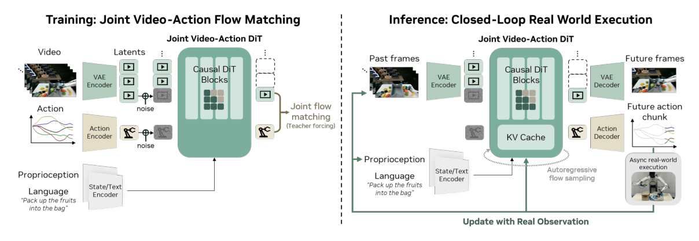

The numbers matter for both halves of this post. On generalization to new environments and objects, DreamZero reaches 62.2% average task progress against 27.4% for the best pretrained VLA baseline, more than two times better, and on tasks entirely absent from training it hits 39.5% where from-scratch VLAs score under one percent. On data, it is more aggressive than Rhoda: it adapts to a brand new robot on 30 minutes of play data, 55 trajectories, and lifts unseen-task performance using 10 to 20 minutes of video-only demonstrations from another robot or a human, with no action labels at all. And on the loop, it does what the literature kept saying could not be done, closing a video-generation control loop in real time, but the asterisk is the whole argument: it reaches 7 Hz only on two GB200s, after a 38x optimization pass that cut latency from 5.7 seconds to 150 milliseconds per chunk, and the paper concedes that a VLA runs above 20 Hz on a single consumer GPU. Edge deployment is named as future work.

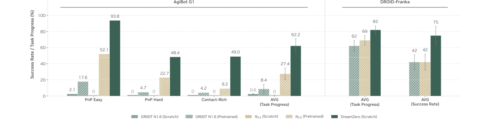
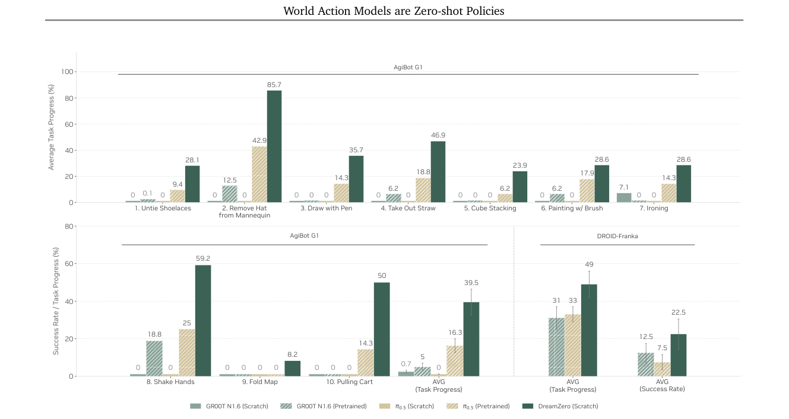

On generalizability, I am bullish with caveats. Predicting video lets the pretraining objective absorb internet-scale human video, and the literature is consistent that video pretraining transfers to new objects, backgrounds, and tasks. Rhoda's long-context memory and its one-shot following of a human demonstration at test time, with no weight update, are real affordances that action-chunking VLAs do not have natively. The caveat is the embodiment gap. A human hand in an internet video is not a parallel gripper, and the inverse dynamics model still has to be trained per embodiment. So I read this as plausibly better cross-task transfer than a VLA. The cross-embodiment claim is no longer just Rhoda's to assert: DreamZero posts a robot-to-robot and a human-to-robot transfer on a shared benchmark, at moderate absolute success, which is more evidence than Pi's direct cross-embodiment training has had to face. The embodiment gap is narrower than I assumed, though the inverse dynamics still train per robot.

On ease of data collection, this is the strongest leg of the thesis and the part I find most credible. The video model trains on passive, unlabeled video. No teleoperation, no action labels. Only the inverse dynamics stage needs robot data, ten hours or so, and that data can be random motion rather than expert demonstration. Set that against Pi's 10,000-plus hours of robot data for pretraining, or the hundreds of hours that scaled diffusion policies consume. The marginal cost of the next task genuinely drops, if the prior transfers. That conditional is doing real work, but the direction is right. DreamZero is the strongest evidence yet that the conditional holds: a new robot learned from 30 minutes of play, and unseen tasks improved from 10 to 20 minutes of video with no action labels. That is the data-efficiency thesis made reproducible, and on a sharper number than Rhoda's own.

On total addressable market, I am mixed. The tasks Rhoda actually shows, decanting, container breakdown, returns processing, sorting, packing, are exactly the high-mix, low-rate, quasi-static manipulation tasks that Pi, Dyna, and Generalist are also chasing in warehousing and light manufacturing. That is a large market, but it is a contested one, not a market the video approach unlocks alone. The expansion case is high-speed, contact-rich work, fast assembly and dynamic handling, and that is precisely where video generation's cost becomes the binding constraint. DreamZero puts a price on that constraint: it needs two datacenter GPUs to hold 7 Hz, while a flow-matching VLA clears 20 Hz on one consumer card. The high-speed half of the market is exactly where that gap bites.

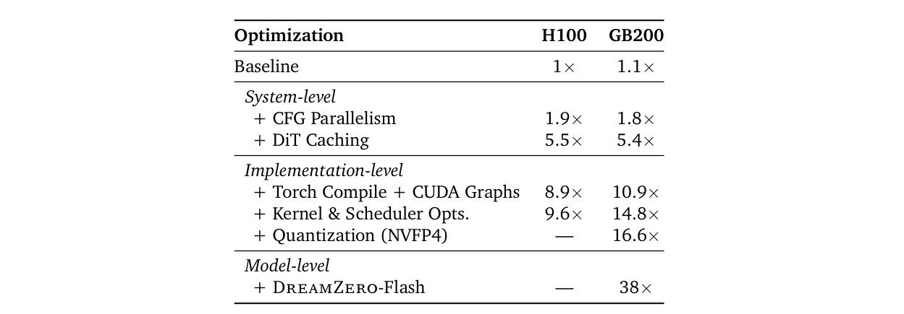

This is where the serious counter-position lives, and it comes from the company I picked. Physical Intelligence's position, shared in spirit by Toyota Research Institute's Large Behavior Models (arXiv 2507.05331), is that you do not need to generate video to close the loop. Action chunking with flow matching already drives dexterous tasks at 50 Hz, and RTC already survives the latency that breaks naive loops, without paying to denoise a video at control rate. TRI makes the same point from the scaling side: a multitask diffusion transformer predicting 1.6-second chunks gets dexterous manipulation without exotic machinery, and multitask pretraining cuts per-task data by about 80%.

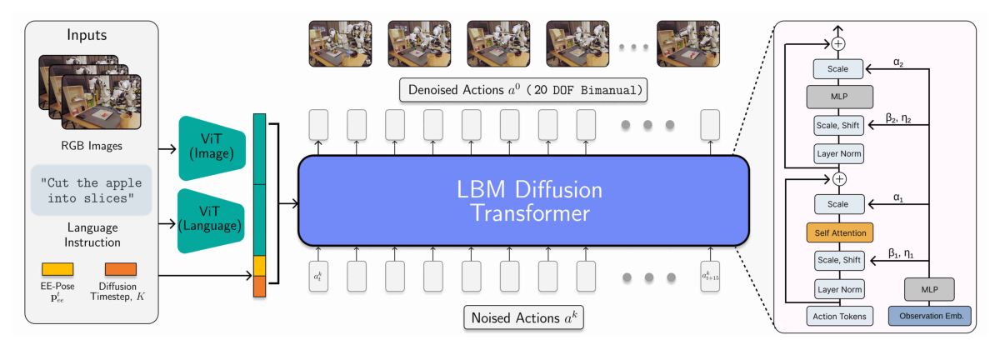

The strongest form of this is an inference-economics argument, and it is correct on its own terms. Video diffusion is repeatedly described in the literature as too slow for real-time control. MinD (arXiv 2506.18897) says exactly that, and the cases that do run in real time do so at very low resolution, around 5 Hz at 96 by 160 in VILP (arXiv 2502.01784). DreamZero now quantifies the same point from inside the video camp: a 14B video model reaches 7 Hz only after a 38x optimization pass and only on two GB200s, an order of magnitude more compute than the VLA it beats on generalization.

What the counter-position gets right is that today, action chunking is cheaper and demonstrably fast. What it pushes the tension to is the data curve. If the internet-video prior transfers the way Rhoda is betting, the action-chunking camp wins on inference cost while losing on data cost, and which one matters more depends on whether your bottleneck is latency or labeled demonstrations. As of February 2026 the success table I said did not exist does: DreamZero publishes a latency budget and beats π0.5 and GR00T N1.6 head to head on shared tasks, with open weights. What it does not publish is the part that decides deployment. Its loop closes at 7 Hz on two GB200s, not on an embedded GPU, and the paper files edge deployment under future work. Rhoda's situation is worse on disclosure, not better: its widely repeated 10 Hz figure is an outside analyst's conditional estimate, not a Rhoda number. So control as video prediction has become a demonstrated data-efficiency result on shared benchmarks, and it is still not a deployment-rate result on hardware you could bolt to a robot.

## Where the loop gets cheap

Collapse the three lenses into one diagnostic and the picture is simple. A company that discloses its loop can be underwritten, and one that discloses only its outcomes cannot. Physical Intelligence discloses the loop. Skild discloses the outcome. Dyna and Generalist sit between, each strong on one axis. The axis where the next advantage gets won is data economics, and the interesting fact is that Rhoda and Generalist are attacking it from opposite ends, passive internet video against cheap wearable capture, while Pi keeps paying for robot data and buying down inference risk instead. NVIDIA is now a third front on that axis, with an open World Action Model that eats the inference cost on datacenter silicon for now.

Most of the artifact that would settle the argument now exists. DreamZero closed a video-prediction loop, published a latency budget, and put a head-to-head success table against π0.5 and GR00T N1 on shared AgiBot and DROID tasks, with the weights and code in the open. The one piece still missing is the one that matters most for the floor: that loop runs at 7 Hz on two GB200s, not at deployment rate on an embedded GPU, and the team that built it says edge is future work. The gap has moved from nobody has shown closed-loop video prediction with a real success table to nobody has shown it at deployment rate on deployable hardware. Rhoda, for its part, has still published one research post and a set of uncut demos, and none of these numbers.

Here is the falsifiable version, and DreamZero has already settled two thirds of it. The original test was three-part: a head-to-head success table against a flow-matching VLA, transfer to a new embodiment on ten hours or less of inverse-dynamics data, and on-robot closed-loop inference at 10 Hz or better on embedded hardware. The first two are done, in February 2026, well ahead of my 2027 date: the table exists, and the embodiment transfer happened on thirty minutes. The third is not, and it is the one that decides the pick. DreamZero runs at 7 Hz on two datacenter GPUs, which is the datacenter outcome I said would keep action chunking ahead, not the embedded one that would flip it. So the prediction sharpens to a single gate. The pick flips when a video-prediction policy holds 10 Hz or better on hardware you could mount on the robot, a single consumer-class GPU rather than a pair of GB200s. Everything else the video camp needed, it now has.

The bet I would actually make still sits between the two camps, and DreamZero is an argument for it, not against it. Put a video-prediction model on top, proposing at low rate from the internet-video prior, and a flow-matching controller underneath, closing the loop at 200 Hz. Slow-propose, fast-comply. NVIDIA labels DreamZero the other way around, as a System 1 it hopes to shrink onto an edge device with a System 2 planner stacked above it, but its own economics, two GB200s for 7 Hz, are the strongest case I have seen that video generation belongs in the slow half of the stack, not the fast loop where the robot actually lives.

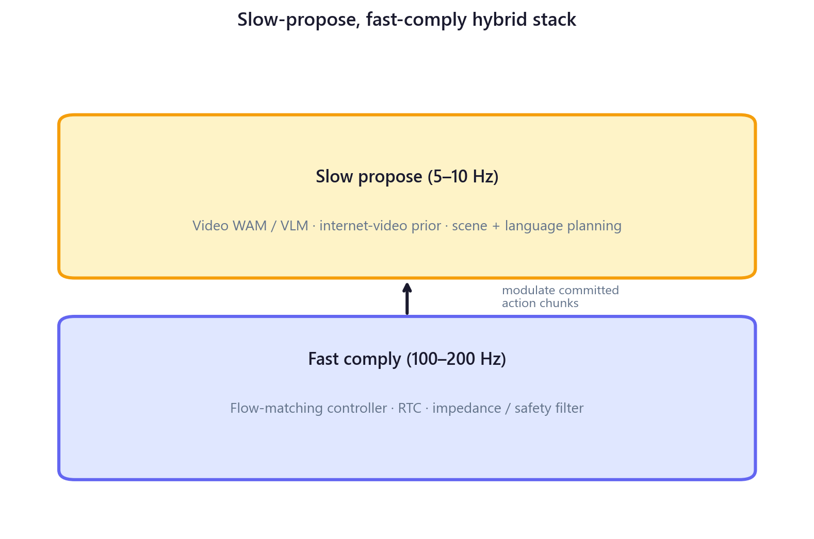

## References

Black, Kevin, et al. "π0: A Vision-Language-Action Flow Model for General Robot Control." *arXiv*, 31 Oct. 2024, arxiv.org/abs/2410.24164.

Black, Kevin, et al. "Real-Time Execution of Action Chunking Flow Policies." *arXiv*, 7 June 2025, arxiv.org/abs/2506.07339.

Brohan, Anthony, et al. "RT-2: Vision-Language-Action Models Transfer Web Knowledge to Robotic Control." *arXiv*, 28 July 2023, arxiv.org/abs/2307.15818.

Cheang, Chi-Lam, et al. "GR-2: A Generative Video-Language-Action Model with Web-Scale Knowledge for Robot Manipulation." *arXiv*, 8 Oct. 2024, arxiv.org/abs/2410.06158.

Du, Yilun, et al. "Learning Universal Policies via Text-Guided Video Generation." *arXiv*, 31 Jan. 2023, arxiv.org/abs/2302.00111.

Dyna Robotics. "Dyna Robotics Unveils DYNA-1: The First Commercial-Ready Robot Foundation Model Offering Fully Autonomous, Round-the-Clock Dexterity." *PR Newswire*, 30 Apr. 2025, prnewswire.com/news-releases/dyna-robotics-unveils-dyna-1-the-first-commercial-ready-robot-foundation-model-offering-fully-autonomous-round-the-clock-dexterity-302441437.html.

Figure AI. "Helix: A Vision-Language-Action Model for Generalist Humanoid Control." *Figure*, 20 Feb. 2025, figure.ai/news/helix.

Figure AI. "Introducing Helix 02: Full-Body Autonomy." *Figure*, figure.ai/news/helix-02.

Generalist AI. "GEN-1: Scaling Embodied Foundation Models to Mastery." *Generalist*, 2 Apr. 2026, generalistai.com/blog/apr-02-2026-GEN-1.

Jang, Joel, et al. "DreamGen: Unlocking Generalization in Robot Learning through Neural Trajectories." *arXiv*, 2025, arxiv.org/abs/2505.12705.

Ko, Po-Chen, et al. "Learning to Act from Actionless Videos through Dense Correspondences." *arXiv*, 12 Oct. 2023, arxiv.org/abs/2310.08576.

Kim, Moo Jin, et al. "OpenVLA: An Open-Source Vision-Language-Action Model." *arXiv*, 13 June 2024, arxiv.org/abs/2406.09246.

"MinD: Learning a Dual-System World Model for Real-Time Planning and Implicit Risk Analysis." *arXiv*, 23 June 2025, arxiv.org/abs/2506.18897.

NVIDIA. "GR00T N1: An Open Foundation Model for Generalist Humanoid Robots." *arXiv*, 18 Mar. 2025, arxiv.org/abs/2503.14734.

Physical Intelligence, et al. "π0.5: a Vision-Language-Action Model with Open-World Generalization." *arXiv*, 22 Apr. 2025, arxiv.org/abs/2504.16054.

Physical Intelligence, et al. "Knowledge Insulating Vision-Language-Action Models: Train Fast, Run Fast, Generalize Better." *arXiv*, May 2025, arxiv.org/abs/2505.23705.

Rhoda AI. "Causal Video Models Are Data-Efficient Robot Policy Learners." *Rhoda AI*, Mar. 2026, rhoda.ai/research.

Team Wan. "Wan: Open and Advanced Large-Scale Video Generative Models." 2025.

Toyota Research Institute. "A Careful Examination of Large Behavior Models for Multitask Dexterous Manipulation." *arXiv*, 7 July 2025, arxiv.org/abs/2507.05331.

Xu, Zhengtong, et al. "VILP: Imitation Learning with Latent Video Planning." *arXiv*, 3 Feb. 2025, arxiv.org/abs/2502.01784.

Ye, Seonghyeon, et al. "World Action Models are Zero-shot Policies." *arXiv*, 17 Feb. 2026, arxiv.org/abs/2602.15922.

## Figures

Black, Kevin, et al. "π0: A Vision-Language-Action Flow Model for General Robot Control." *arXiv*, 31 Oct. 2024, arxiv.org/abs/2410.24164. Fig. 3 reproduced from arXiv PDF page 4 for commentary.

Black, Kevin, et al. "Real-Time Execution of Action Chunking Flow Policies." *arXiv*, 7 June 2025, arxiv.org/abs/2506.07339. Figure 1 reproduced from arXiv PDF page 1 for commentary. NeurIPS 2025.

Du, Yilun, et al. "Learning Universal Policies via Text-Guided Video Generation." *arXiv*, 31 Jan. 2023, arxiv.org/abs/2302.00111. Figure 2 reproduced from arXiv PDF page 4 for commentary.

Physical Intelligence, et al. "Knowledge Insulating Vision-Language-Action Models: Train Fast, Run Fast, Generalize Better." *arXiv*, May 2025, arxiv.org/abs/2505.23705. Figure 1 reproduced from arXiv PDF page 2 for commentary.

Sarda, Sheil. "Rate Stack Ladder for Robot Foundation Models." *Diagram*, 2 June 2026. Robotics blog illustration.

Sarda, Sheil. "Slow-Propose, Fast-Comply Hybrid Stack." *Diagram*, 2 June 2026. Robotics blog illustration.

Toyota Research Institute. "A Careful Examination of Large Behavior Models for Multitask Dexterous Manipulation." *arXiv*, 7 July 2025, arxiv.org/abs/2507.05331. Figure 9 reproduced from arXiv PDF page 12 for commentary.

Ye, Seonghyeon, et al. "World Action Models are Zero-shot Policies." *arXiv*, 17 Feb. 2026, arxiv.org/abs/2602.15922. Figure 4, Figure 8, Figure 9, and Table 1 reproduced from arXiv PDF pages 6, 13, 14, and 10 for commentary.
