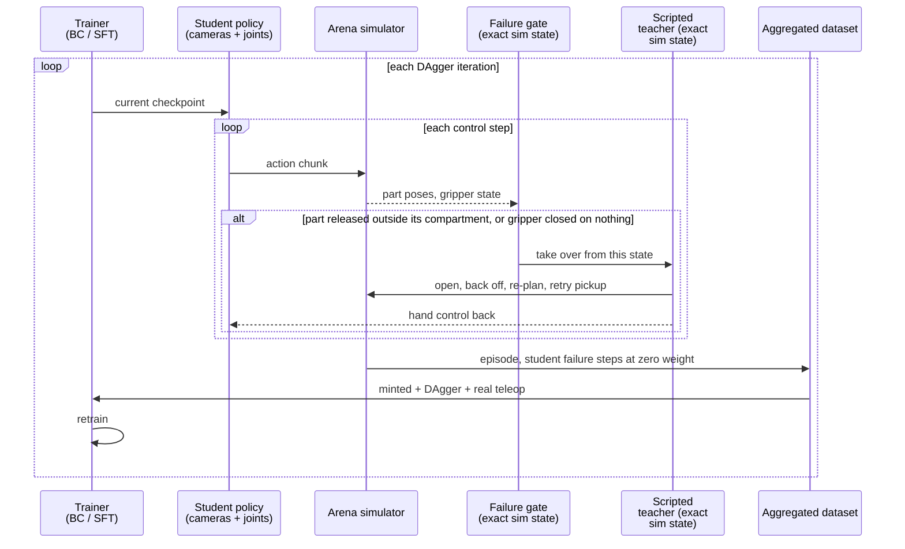

# Our scripted teachers can label the student's mistakes

Draft, October 3, 2026.

In Nick's evaluation video, a learned policy drives two YAM arms in simulation, sorting nuts, screws and bearings out of a tote. It keeps retrying its grasps, which a policy trained on simulated data alone did not do. It also moves like a script. In Nick's words, "the pattern is quite scripted and it loses the diversity of contact-rich movement of real teleop data."

Nick co-trained that policy on 500 episodes minted by our scripted sorting teacher plus 332 real teleoperated episodes. He then swept the mix: 50 sim episodes with 50, 100, 200 or 332 real ones, all 332 real episodes with 25 to 100 sim ones, and sim alone. His summary: "From the same set of sim data, any addition of sim data deteriorates the real teleop data performance." He measured this in simulation, on the first code-as-policy version of the minted data, and a second version is waiting on infrastructure.

Sun asked why sim data would hurt when training and evaluation share a simulator. Two things differ: the training scenes leave out the office room's background, and the evaluation suite is separate from the training distribution. Nick's diagnosis points at the data itself. In the minted episodes the first grasp follows almost the same trajectory every time. Once that grasp fails, the policy sits in a state it has never seen and has no idea what to do.

The teacher's code agrees with him. Our sorting teacher ends the episode at its first failed physical grasp: `grip_retry.py` sets the number of allowed failures to zero, with the comment "User request: no failed physical attempts in clean trajectories." The mint keeps accepted episodes and files the rest in a separate failure dataset. Our 500 training episodes therefore contain no missed grasp and no recovery from one. Jing Yi found a second gap. The teacher closes a gripper only around a part, so a closed, empty gripper never appears in the data, and a student whose grasp slips lands somewhere with no precedent.

I have come to think of demonstrations this way. They teach a policy its tools: the skills, and a default plan for using them. They say much less about judgment, the choice of what to do once the episode leaves the typical path. A scripted teacher sits at the far end of that range, because it takes the typical path every time and stops when it can't.

Our teachers have one advantage over a human demonstrator. They read the simulator's exact state, the pose of every part and joint, and they plan from it. In principle they can look at any state the student reaches and say what to do from there. DAgger, an imitation-learning algorithm from 2011, asks the expert for that ability and little else, and in simulation the expert costs GPU time instead of a person's afternoon.

## Behavior cloning compounds its own mistakes

A policy maps what the robot observes, such as camera images and joint angles, to its next action. Behavior cloning (BC) trains the policy to predict the demonstrator's action at each recorded moment. It is the supervised fine-tuning (SFT) we already run on minted and teleop data. A state, in this post, means the full situation at one instant: where each arm is, where each part sits, and whether a gripper holds anything.

The demonstrator decides which states appear in the training set. Our teacher visits a narrow band of them, the states along its own successful paths, and the student, the policy we train, learns from those states alone. At test time the student acts, and its own actions pick the next state. A small error moves it off the teacher's band, into a state where its training says little. Its next action is then worse, and the drift grows.

Stéphane Ross, Geoffrey Gordon and Drew Bagnell made this precise in [the DAgger paper](https://arxiv.org/abs/1011.0686) (AISTATS 2011). Suppose the student errs with probability ε on states the expert visits, and the task lasts T steps. Building on Ross and Bagnell's earlier analysis, they note that the student can make as many as T²ε mistakes in expectation, because "as soon as the learner makes a mistake, it may encounter completely different observations than those under expert demonstration, leading to a compounding of errors." The cost grows with the square of the horizon. Training on the student's own states brings the bound down to order Tε, linear in the horizon. Our sorting episode, with nine parts to pick and place and six of them handed between arms, sits at the long-horizon end where the square hurts most.

Their racing experiment shows the same effect. In Super Tux Kart, a 3D racing game, more expert laps did not improve the BC policy, because "most of the training laps are all very similar and do not help the learner to learn how to recover from mistakes it makes." Swap laps for sorting episodes and the sentence describes our minted data.

## DAgger trains the student on the states it reaches

DAgger stands for dataset aggregation. Its loop has four steps:

1. Train a policy on the expert's demonstrations.
2. Run that policy and record the states it visits.
3. Ask the expert what it would do in each of those states, and add the labeled states to the dataset.
4. Retrain on everything collected so far, then return to step 2.

At iteration i the paper runs a mixture: with probability β_i the expert acts, and otherwise the student does. β starts at 1 and decays toward 0, and the simplest version uses the expert's actions in the first iteration alone. The expert never has to rescue the whole episode. It has to name a sensible action from each state the student reached, and nothing more. In Super Tux Kart, the DAgger policy "almost never falls off the track" after 5 iterations and never fell off after 15. A competing method, SMILe, still fell off about twice per lap after 20 iterations.

Step 3 carries the cost. The expert must label a state it did not choose, and in the original scheme it does so without being in control of the system. Humans find that hard. The authors of [HG-DAgger](https://arxiv.org/abs/1810.02890) (Kelly et al., 2018) write that this "can decrease safety" and, with a human expert, is likely to degrade the labels "due to perceived actuator lag." The variants below each make step 3 cheaper or safer, by changing who labels and which states get labels.

## Later methods change who labels and which states they label

| Method | Labeler | States labeled | Reported result |
| --- | --- | --- | --- |
| [DAgger](https://arxiv.org/abs/1011.0686) (AISTATS 2011) | The expert, after each student rollout | Every state the student visits | Super Tux Kart: no falls off the track after 15 iterations |
| [DART](https://arxiv.org/abs/1703.09327) (CoRL 2017) | The expert, while demonstrating | States the expert reaches when noise perturbs its own actions | 62% average gain over BC on real grasping in clutter |
| [HG-DAgger](https://arxiv.org/abs/1810.02890) (2018) | A human who takes control when the student looks unsafe | States where the human stepped in | Beat DAgger and BC on simulated and real driving |
| [ThriftyDAgger](https://arxiv.org/abs/2109.08273) (CoRL 2021) | A human, when the robot asks | States the robot judges novel or risky | Cable routing on a real robot; 80% better robot performance than the next best method in a 10-person user study |
| [Learning by Cheating](https://arxiv.org/abs/1912.12294) (CoRL 2019) | A driving agent that reads the ground-truth map | States from the camera-based student's own rollouts | 100% success on all tasks of the original CARLA benchmark |
| [Lee et al.](https://arxiv.org/abs/2010.11251) (Science Robotics 2020) | A legged teacher that knows the terrain and its contacts | States from the student's rollouts | Quadruped walked on mud, snow and rubble it never saw in training |
| [IntervenGen](https://arxiv.org/abs/2405.01472) (2024) | 10 human corrections, transformed to new scenes | Synthetic mistake states | Up to 39x more robust to pose-estimation error |
| [FoldNet KG-DAgger](https://arxiv.org/abs/2505.09109) (2025) | A keypoint script that detects grasp failures and retries | Student rollouts in simulation | Real garment folding from 50% to 75% success |

DART, from Michael Laskey and colleagues at Berkeley, skips the student entirely during collection. It injects noise into the expert's actions while the expert demonstrates, so the expert drifts off its own path and has to recover, and it tunes the noise level to match the errors the trained robot will make. Their abstract reports that on the simulated Humanoid task DART lowered the expert's reward by 5% during collection, while DAgger ran policies with 80% less reward than the expert. HG-DAgger and ThriftyDAgger keep a human in the loop and ration the human's time: in HG-DAgger the human takes over when the student goes wrong, and in ThriftyDAgger the robot asks for help at states it finds novel or risky.

Two papers match our situation, because their experts read state that the student cannot see. In Learning by Cheating, Dian Chen and colleagues first trained a driving agent that "cheats" by reading the ground-truth map and the positions of all other traffic. That agent then taught a camera-only agent, and because the privileged agent could answer for any state, the authors gathered its labels "adaptively via online rollouts of the sensorimotor agent," which they call "automatic DAgger-like training." Joonho Lee and colleagues did the same for a quadruped in 2020. They trained a teacher by reinforcement learning with ground-truth terrain and contact information, then trained a student that sees only proprioception, the robot's own joint and body sensing, with DAgger: "training data is generated by rolling out trajectories by the student policy. For each visited state, the teacher policy computes its embedding and action vectors."

FoldNet, which Dalton flagged, sits closest to what we would build. Yuxing Chen, Bowen Xiao and He Wang wrote scripted folding policies that read garment keypoints in simulation, trained a diffusion policy on their output, and then ran the policy with a keypoint-based monitor. The monitor plays the role a human plays in HG-DAgger. It detects a failed grasp from the keypoints and the gripper state, and a scripted recovery takes over and retries the grasp. FoldNet gives the actions that caused the failure zero weight in the training loss, keeps the recovery, and runs this only in simulation and only during training. Their observation about the baseline could have come from Nick's thread: "the model trained exclusively on perfect demonstrations fails to retry after a grasp failure." They also compared a DART-like baseline that perturbs the expert's actions before execution. It beat perfect demonstrations, and KG-DAgger beat it.

[MimicGen](https://arxiv.org/abs/2310.17596), from Ajay Mandlekar and colleagues at NVIDIA, multiplies data in a different way. It splits about 200 human demonstrations into segments, one per object-centric subtask, transforms each segment to new object poses and stitches them together, producing over 50,000 demonstrations across 18 tasks. That widens the starting conditions but keeps each segment's shape, so on its own it would not add recovery. [IntervenGen](https://arxiv.org/abs/2405.01472) applies the same transformation to human corrections and reports that a policy trained on corrections generated from 10 human interventions beat one trained on 100 real interventions by 24%. Its authors note in passing that experts on privileged simulator state "can require significant engineering." We have already paid that cost for several tasks.

Qi Chen's teleop-guided runs try a variant for language-model students. When the student reaches a state the teacher flags, such as the first arm motion after an inverse-kinematics rejection, the teacher writes a short reasoning hint into the student's next turn instead of an action. The hint might say to check which arm can reach the bottle before forcing a pose. The student then chooses and runs its own code. Qi's reason: injecting hints instead of actions keeps every action grounded in the observations the student has seen. At export, the hint becomes part of that turn's reasoning, and the row records whether the student acted on it. In the reviewed episode, the student acted on all three hints and packed all three bottles. That's DAgger's loop with the label moved from the action to the reasoning that precedes it.

A NeurIPS 2026 paper attacks the same mismatch from the data side. DAgger fixes it by labeling the states the student visits. [Finetuning with Sampling](https://arxiv.org/abs/2610.02140), from Aayush Karan, Sitan Chen and Yilun Du, keeps the expert's traces and reshapes them instead. A Markov chain Monte Carlo sampler rewrites them step by step to look more like what the model being fine-tuned would generate. Plain SFT on the rewritten traces rivals on-policy training on reasoning and skill tasks, often generalizing better and forgetting less. The paper tests language models, not robots. For us it suggests a cheap first step before building teacher takeover: move the minted traces toward the student's own behavior, then measure whether recovery improves.

## Fine-tuning reproduces the demonstrator's paths

Two results outside DAgger explain the gap between tools and judgment. In [SFT Memorizes, RL Generalizes](https://arxiv.org/abs/2501.17161), Tianzhe Chu and colleagues compared SFT with reinforcement learning (RL) on an arithmetic card game and a real-world navigation task, each tested on variants with changed rules or changed visuals. RL with an outcome reward generalized to the variants, while SFT "tends to memorize training data and struggles to generalize out-of-distribution scenarios." SFT remained necessary before RL, to stabilize the model's output format.

[RL4VLA](https://arxiv.org/abs/2505.19789) (NeurIPS 2025) ran the same comparison on a vision-language-action model, OpenVLA, fine-tuned on pick-and-place trajectories from a motion planner, which makes its SFT data close kin to our minted data. Table 1 of the paper lists success rates for SFT and for RL with PPO, a standard RL algorithm:

| Test condition | SFT success | RL success |
| --- | --- | --- |
| Unseen robot starting pose | 33.9% | 79.7% |
| Object moved during the episode | 28.6% | 74.5% |
| Unseen objects | 45.3% | 71.4% |
| Unseen object and receptacle positions | 56.8% | 80.7% |

The authors describe the behavior behind those numbers. RL "learned to recover from failed grasps and mid-episode object shifts," while SFT "marches on in spite of position errors, likely because such cases never appear in the demonstration data." Their SFT rollouts "cluster along the motion-planner paths present in the dataset." The appendix adds a detail Jing Yi would recognize. The planner's data contained idle steps, and OpenVLA trained on it got stuck mid-task. The authors fixed this by dropping actions below a small motion threshold, which removed about a third of them. Jing Yi's list for the next sort mint includes removing the teacher's pauses.

RL is one way to reach the states the demonstrator never visited. DAgger is another, and it keeps the supervised loss we already run.

## Our teachers re-plan between steps and play each step open loop

DAgger asks one thing of the teacher: an action for an arbitrary state. I read the teacher code on main to see how far ours are from that. The facts below come from `robot/agentic_policy/taskspec/README.md`, the sorting task under `robot/agentic_policy/taskspec/tasks/sort_from_tote_yam/`, and the motion layer in `robot/agentic_policy/taskspec/motion.py`.

A teacher is a Python object with a `run(context)` method that executes a whole Subtask, one atomic behavior such as sorting the tote. The context hands it privileged state, the exact joint and body poses, plus a planner-backed world model and a motion object per arm. The teacher drives the simulator itself: its motion calls plan a trajectory, then step the environment until the arm arrives. No function in the stack takes a state and returns the next action. The README states the failure policy: "Each phase fails explicitly to a report; it does not retry the entire manipulation."

Inside `run`, though, the sorting teacher reads live state at every decision point. Each pickup iteration re-evaluates which parts are sorted, re-selects a part and grasp, and plans the approach from the arm's current joint angles. After the approach it re-reads the part's actual pose, because loose parts settle, and checks that the fingers will enclose the part before it closes them. The shared cuRobo planner in `motion.py` captures a fresh world snapshot on each call, and the sorting teacher's own inverse-kinematics search starts from the arm's current joints. So the teacher acts as a state-feedback controller at the scale of one pickup and as an open-loop script within each motion segment.

The same code shows one plausible source of Nick's identical first grasps. `pickup_route.plan` seeds its inverse-kinematics search with the current joints, the ready pose, and 16 random starts drawn from a fixed random seed, then ranks the solutions by distance from the ready posture. Every episode starts with all six YAM arm joints at zero. With the same start, the same seeds and the same ranking, the arm should take much the same path to its first part, with the part's position as the main source of variation. This is a hypothesis from reading the code; we have not measured it.

Three assumptions stand between this teacher and DAgger. It assumes it starts with empty hands from the reset pose: `run` begins by clearing the receiver arm and starting the pipeline, and the checkpoint-restore helper in `pickup_checkpoint.py` saves "direct empty-hand sorting checkpoints." It assumes it caused the state it is in, so it has no branch for a part dropped mid-transport other than raising `GripFailure`. And it assumes it holds the simulator, so a student cannot share the episode with it. Today the student runs in a different harness: the policy-evaluation flow runs a LeRobot policy server next to Arena on Modal, while minting runs the teacher through the taskspec episode runner.

## Three changes let the teacher label the student's states

The cheapest change touches the start of each episode. Jing Yi plans to randomize start positions in the next sort mint, with grippers sometimes closed, and Astra recommended 70% of episodes from the usual start and 30% from a randomized one. Arena today resets the YAM arms to zero joints, so this needs a reset event that samples arm joints and gripper widths within limits and checks them for collisions. The teacher already plans its approach from the current joints, so it should cope with an arbitrary arm pose. It would need to open a closed gripper before its first approach. Randomized starts resemble DART in one respect: the expert still drives, from states it would not choose. They widen the start of the episode and leave the middle untouched, which is where Nick's first grasp fails.

The second change brings the student into the loop, in the style of HG-DAgger and FoldNet. We run the student in Arena, and a gate watches the privileged state. Arena's sorting progress module already reports, per part, whether it is released and whether it sits in its compartment; the teacher's own `require_contact` check uses that signal to detect a dropped part. Once the gate fires, the teacher takes over from the live state: it opens the gripper, backs away, re-selects a part and finishes the pickup, and then hands control back to the student. We record the whole episode, give the student's actions before the failure zero weight as FoldNet does, and keep the teacher's recovery as training data.

This needs work in four places, and none of it exists on main. We need one process that runs student inference and the teacher against the same Arena environment. We need a teacher entry point that starts mid-episode with the arm anywhere and the gripper in any state, which the grip-retry path almost provides once the allowed failures rise above zero. We need the gate, built on the progress module. And the mint recorder needs a per-frame weight or label that marks student, failure and teacher steps, which the converter carries into the training format.

The third change is full DAgger: a teacher label at every state the student visits, with the student staying in control. Our teachers cannot answer that question without running, because their actions come out of a blocking `run`. One route branches the simulation. At a sampled student state we save the scene, run the teacher for one action chunk, record its commands as the label, restore the scene and let the student continue. Our checkpoint helper saves scene state through Isaac Lab's `scene.get_state`, but its comment in `pickup_checkpoint.py` warns that "PhysX contact/warm-start caches are NOT available through scene.get_state; repeatability must be measured, not assumed." Each label also costs a planner call. The other route rewrites the teacher as a function from privileged state to the next action chunk, which is a larger refactor of the sorting code. I would build the takeover version first and attempt full DAgger only if takeover data helps.

Learning by Cheating and Lee et al. both trained students that see less than their teachers, and that gap brings a hazard. The teacher acts on information the student cannot see, such as the exact pose of a part buried under another. If the teacher's correction depends on something hidden from the cameras, the student cannot learn it, and it will average over cases it cannot tell apart. Corrections should move toward what the wrist and top cameras show.

## Injected failures produce recovery data faster than waiting for the student to fail

A student that grasps well at the start fails at a low rate, so takeover data piles up at the same low rate. We can cause failures on purpose and let the teacher recover, during minting or during student rollouts. Candidates include opening the gripper for a moment during the lift, shifting the target part a few centimeters just before the fingers close, which mirrors RL4VLA's mid-episode repositioning test, and adding DART-style noise to the teacher's joint targets during its approach. The release signal from the progress module tells us whether a perturbation caused a real failure. None of these perturbations exist in Arena or the policy-evaluation suites today. Moving a part by teleporting it risks interpenetration with its neighbors, so pushes and gripper commands look safer than setting poses.

## Real teleop and sim data need a mixing knob

Our mint-train-evaluate flow trains Pi0.5 on one or more datasets of the same task and "samples uniformly across their combined frames." The ratio of sim to real therefore follows from frame counts, which is why Nick's sweeps vary episode counts. [Sim-and-Real Co-Training](https://arxiv.org/abs/2503.24361), from Abhiram Maddukuri and colleagues at UT Austin, NVIDIA and Berkeley, treats the ratio as a parameter instead: α, the probability of drawing each training sample from simulation. On their cup pick-and-place task, with 20 real and 1,000 sim demonstrations, a 50% ratio was suboptimal, 99% worked best, and pushing to 99.5% or 99.9% dropped success from 95% to 60%. Their numbers come from different robots and tasks, and our counts are far closer to even, so they tell us to sweep α and leave its value open.

DAgger data changes what the sim share means. Recovery episodes cover states that teleop and nominal minting both miss, so they should complement the real data without crowding it out. I would add an explicit sampling weight per dataset to the training request and sweep the share of recovery data independent of the share of nominal minted data.

## RL with progress rewards covers what the teacher cannot script

DAgger has a ceiling: the student converges toward the teacher. A scripted teacher will teach the student to recover in a scripted way, and Nick's concern about lost contact-rich variety will survive DAgger, because our teacher does not produce that variety either. DAgger fixes the first problem in his thread, the policy that does not know what to do after a failed grasp, and leaves the second.

RL can go past the teacher. RL4VLA's RL trajectories "span a broader workspace and a richer range of end-effector orientations" than the planner's. The companion post covers the RL plan and progress rewards, which give partial credit for getting closer to success. Sorting already has the raw material for one: the progress module counts correctly sorted parts and tracks releases. The two methods also fit in sequence. Lee et al. trained their teacher with RL and their student with DAgger. For us, BC on minted and teleop data, then sim DAgger, then RL with a progress reward, would hand RL a student that already recovers some of the time. That gives a group of attempts a mix of rewards to compare, which the companion post shows GRPO needs.

## An experiment can separate randomized starts from DAgger

We can test this on sort_from_tote in simulation, on Office v2.1, where the team mints until Xdof delivers real teleop data, holding the 332 real teleop episodes and the evaluation suite fixed. Four training arms isolate the effects:

| Arm | Sim training data | Question it answers |
| --- | --- | --- |
| A | Current minted episodes (500) | Baseline, Nick's 15k-step setup |
| B | Re-minted with 70% usual and 30% randomized starts, some grippers closed | Do varied starts alone fix recovery? |
| C | B, plus 2 to 3 sim DAgger iterations with teacher takeover | Does on-policy recovery data add to B? |
| C' | Same as C, with sim frames capped at B's total | Is any gain from C more than extra data? |

Three metrics target the failure Nick saw, and two more guard against regressions:

- Success after a forced failed grasp. In each evaluation episode, open the gripper for a moment after the first grasp closes, or shift the part before closure, then report the fraction of episodes that re-grasp that part within a time limit and the final count of correctly sorted parts.
- Success from randomized starts. Use held-out arm poses and gripper states, from seeds disjoint from training.
- First-grasp diversity. For each episode, take the end-effector path from the start to the first gripper closure, express it in the target part's frame, resample it to a fixed number of points, and report the mean pairwise distance between episodes and the spread of the final grasp pose. Measure it on the minted data, on the real teleop data as a reference, and on each arm's rollouts.
- Nominal success on the frozen sort suite, both strict success and the correctly-sorted-parts count Nick added this week.
- Sim GPU-hours per added training episode, for each arm.

Each metric needs tooling. The forced-failure and randomized-start cases need new evaluation suite cases. The diversity metric needs recorded trajectories, and policy-eval writes those only for suite cases that define recording, which no built-in suite does today. Minted episodes already record body poses and robot state each control cycle, so the minted side of the diversity metric can run offline now.

My guess, which the experiment would test: B improves success from randomized starts and does little after a forced failed grasp, and C improves both. If C beats A and B on recovery but C' does not, DAgger adds data volume and nothing specific to it. If no arm beats A on recovery, the problem lies outside the data, for example in how the policy uses the wrist cameras.

## Risks and open questions

- Takeover data teaches the teacher's style of recovery. If the real failures differ from the simulated ones, the recovery may not transfer.
- The gate decides which failures we learn from. A gate that fires late teaches recovery from hopeless states; one that fires early hides the student's failure from it.
- The sorting teacher runs inverse-kinematics searches and preflight checks before each pickup, and `actions.py` gives planning a 30 s budget. Labels from branching the simulation would each cost a planning call, and we have not measured that throughput.
- Nick's result came from the first code-as-policy version of the minted data, evaluated in simulation. A second version is pending, and Jing Yi's next mint adds deeper grasps, removes pauses and randomizes starts. We should rerun his baseline on that data before attributing the gap to diversity alone.
- On the real-robot side, our LeRobot rollout bridge lists upstream LeRobot's `dagger` strategy among the recording strategies it accepts. We have not used it, and I have not checked what it does.

## Sources

Papers, all opened and checked against their arXiv abstracts or full text: [DAgger](https://arxiv.org/abs/1011.0686) · [DART](https://arxiv.org/abs/1703.09327) · [HG-DAgger](https://arxiv.org/abs/1810.02890) · [ThriftyDAgger](https://arxiv.org/abs/2109.08273) · [Learning by Cheating](https://arxiv.org/abs/1912.12294) · [Learning Quadrupedal Locomotion over Challenging Terrain](https://arxiv.org/abs/2010.11251) · [MimicGen](https://arxiv.org/abs/2310.17596) · [IntervenGen](https://arxiv.org/abs/2405.01472) · [FoldNet](https://arxiv.org/abs/2505.09109) · [SFT Memorizes, RL Generalizes](https://arxiv.org/abs/2501.17161) · [RL4VLA](https://arxiv.org/abs/2505.19789) · [Sim-and-Real Co-Training](https://arxiv.org/abs/2503.24361)

Code, on spatio_monorepo main as of October 3, 2026: `robot/agentic_policy/taskspec/README.md`, `robot/agentic_policy/taskspec/motion.py`, `robot/agentic_policy/taskspec/tasks/sort_from_tote_yam/` (`fast_policy.py`, `grip_retry.py`, `actions.py`, `pickup_route.py`, `pickup_checkpoint.py`, `config.py`), `robot/arena/environments/bin_flip_then_sort/` (`progress.py`, `environment.py`, `README.md`), `prefect/docs/mint.md`, `prefect/docs/mint_train_evaluate.md`, `prefect/docs/evaluation.md`.
